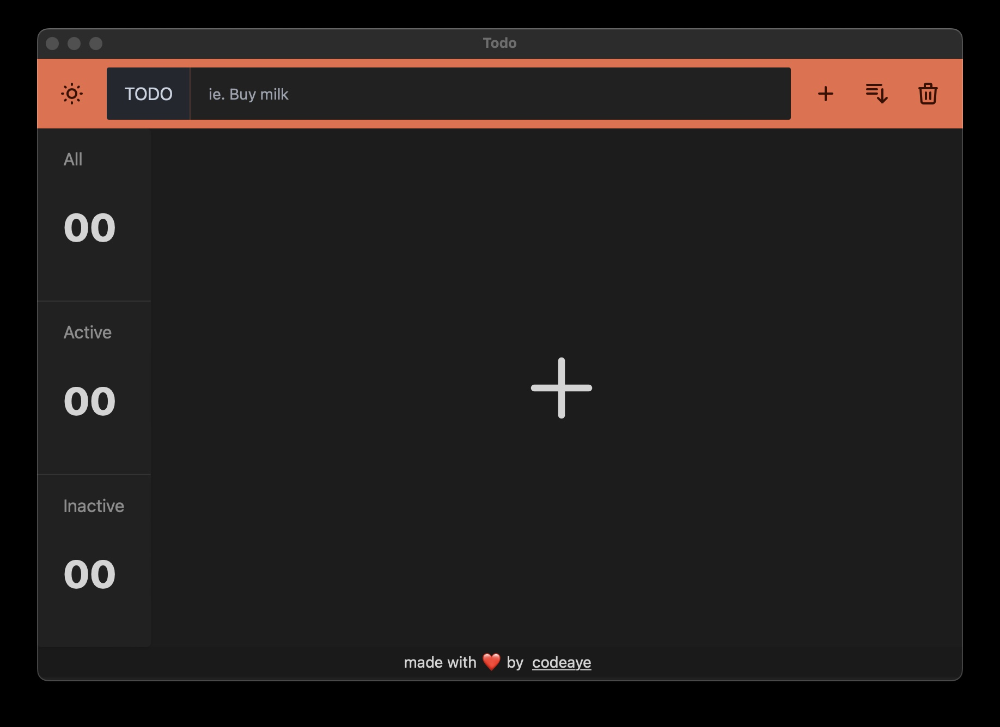
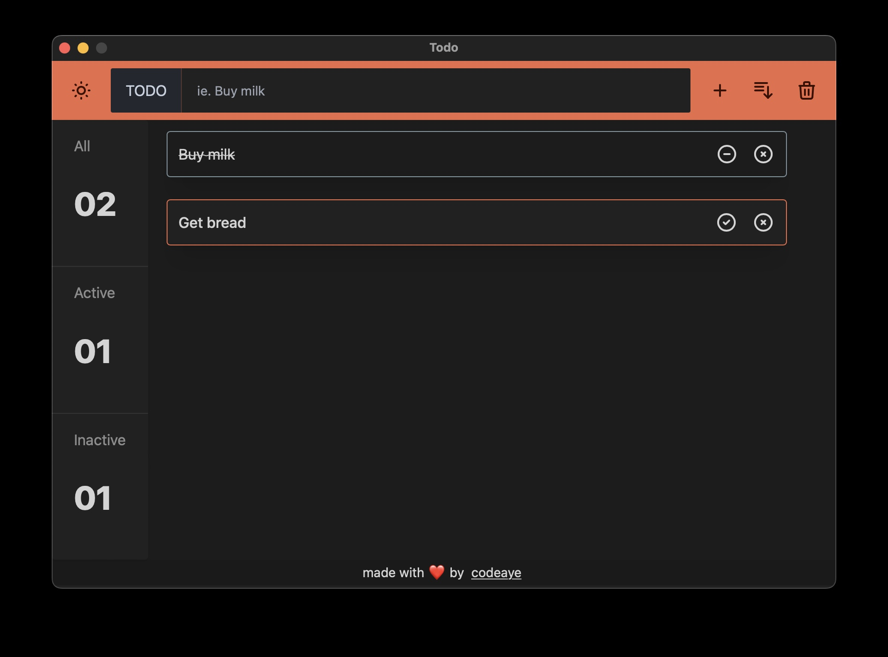
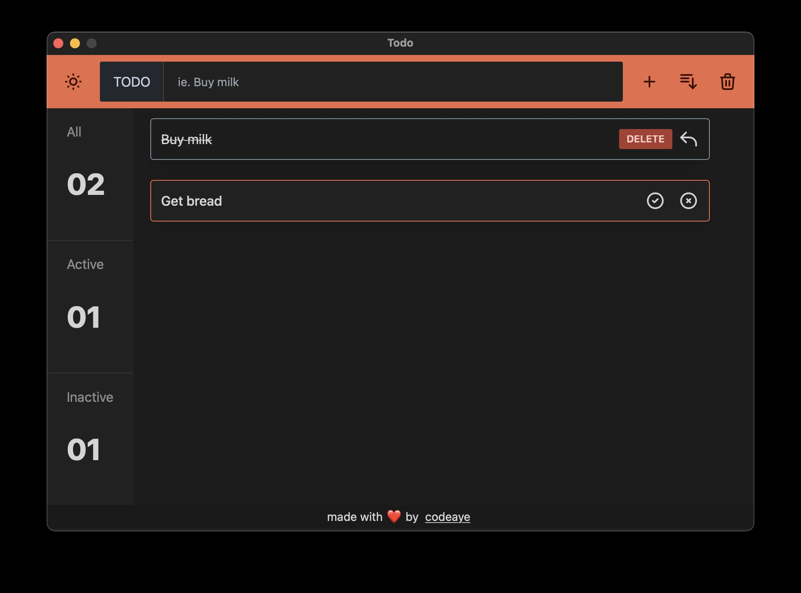
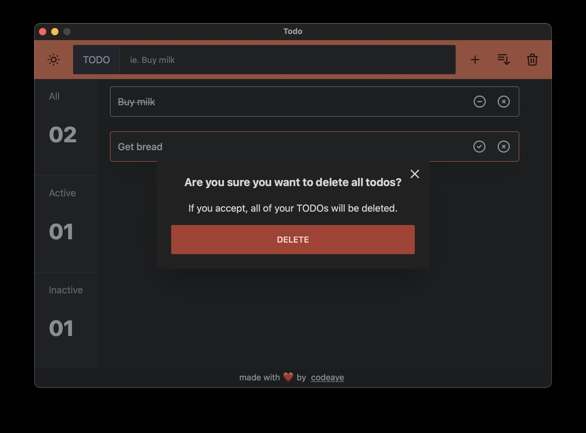
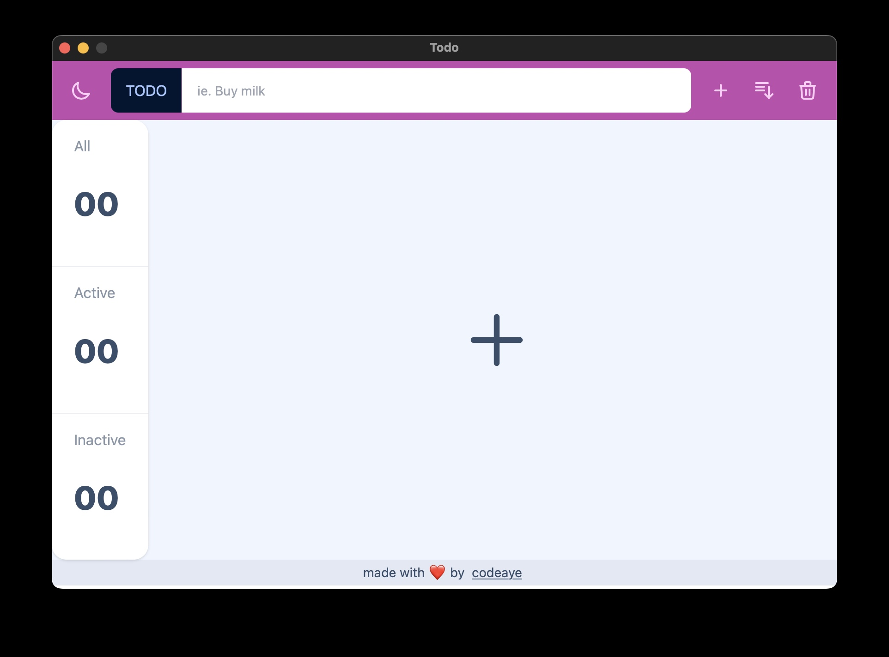
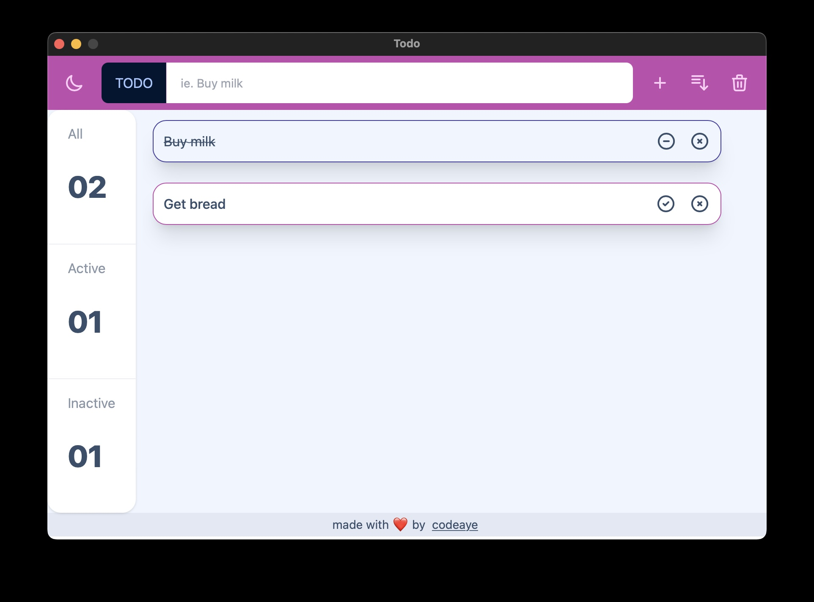
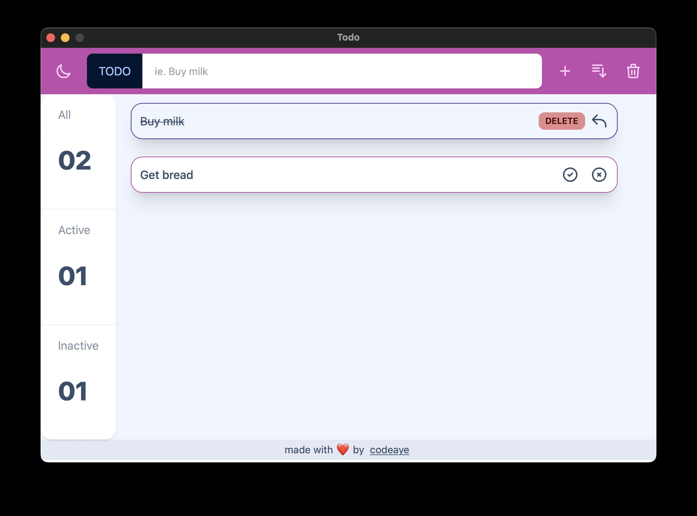
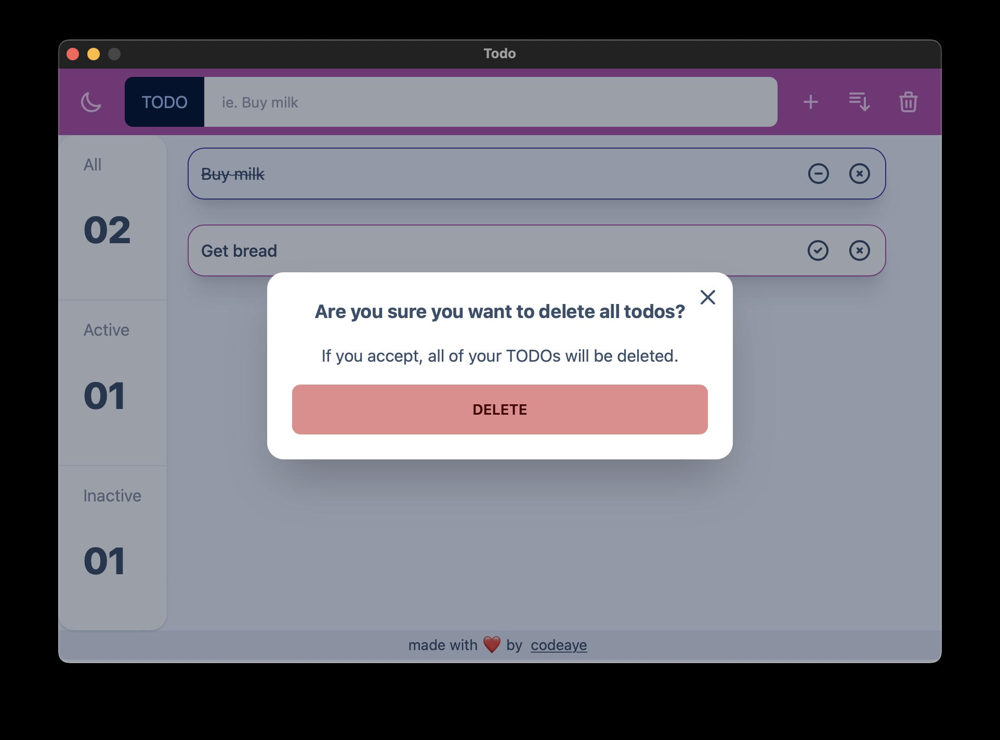

# Todo

An app to manage all of your TODOs in a modern and simple way.

## Screenshots

  
Dark Mode

  # Empty
  
  
  
  # One Active
  
  
  
  # Delete Singular
  
  
  
  # Delete All
  
  

  
Light Mode

  
  # Empty
  
  
  
  # One Active
  
  
  
  # Delete Singular
  
  
  
  # Delete All
  
  

## Installation

Go to [releases](https://github.com/codeaye/todo/releases/) and go to the latest version.
Then download the installer for the platform you need.

## Acknowledgements

- [Tailwind](https://tailwindcss.com/)
- [daisyUI](https://daisyui.com/)
- [Tauri](https://tauri.app/)
- [React](https://reactjs.org/)
- [Vite](https://vitejs.dev/)

## License

[MIT](https://choosealicense.com/licenses/mit/)
